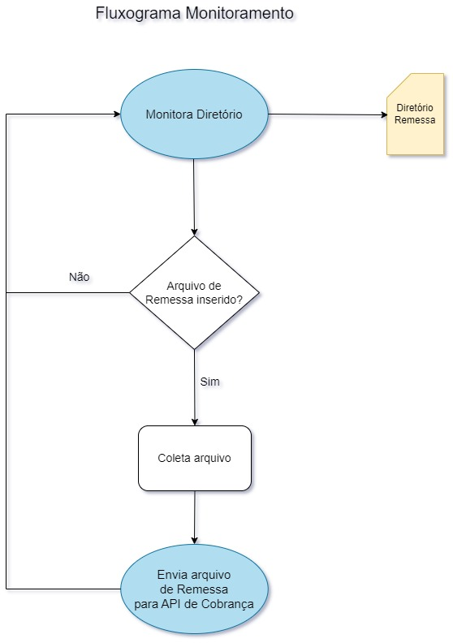
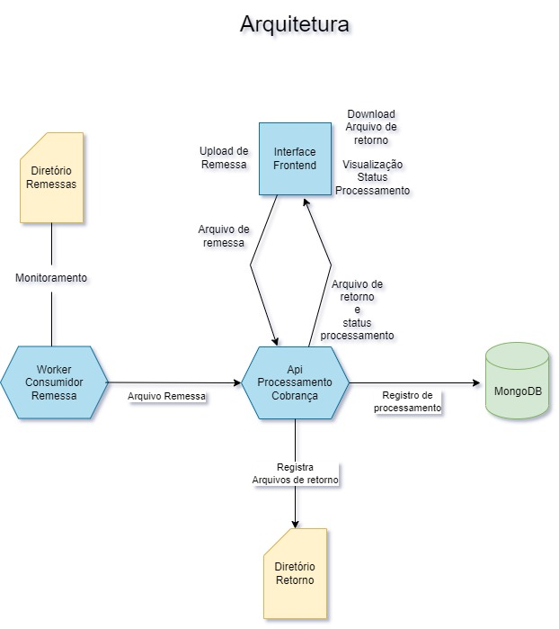

# Monitoramento de diretório de arquivos de remessa

Este projeto consiste em um script Python que utiliza a biblioteca watchdog para monitorar um diretório específico em busca de novos arquivos de remessa. Quando um novo arquivo é detectado, o arquivo é coletado e enviado para a [API De Cobrança](https://github.com/GustavoAV2/ApiShipmentIntegration) onde esse arquivo será processado. Este processador é responsavel por monitorar e encaminhar os arquivos a API, que por sua vez tem a responsabilidade de interpretar os arquivos, gerar o QRCode de cobrança e criar as respostas correspondentes no formato do arquivo de retorno CNAB 750. Após o processamento, o arquivo de retorno é salvo em um diretório de saída.

## Fluxograma

Abaixo está um fluxograma que ilustra o funcionamento do projeto:


## Arquitetura do processor em comunicação com os outros projetos


## Instalação

1. Certifique-se de ter o Python 3.11 instalado em seu sistema.
   [Download Pyhon](https://www.python.org/downloads/release/python-3114/)
3. Clone este repositório em sua máquina local.
4. Navegue até o diretório do projeto:
   ```
   cd ShipmentFileProcessor
   ```
5. Crie um ambiente virtual (opcional, mas recomendado):
   ```
   python -m venv venv
   ```
6. Ative o ambiente virtual:
   - Windows:
     ```
     venv\Scripts\activate
     ```
   - Linux/Mac:
     ```
     source venv/bin/activate
     ```
7. Instale as dependências do projeto:
   ```
   pip install -r requirements.txt
   ```

## Execução

1. Certifique-se de que o ambiente virtual está ativado (veja o passo 5 da seção de instalação).
2. Execute o comando a seguir para iniciar o monitoramento do diretório:
   ```
   python main.py
   ```

## Licença

Este projeto está licenciado sob a [MIT License](LICENSE).
